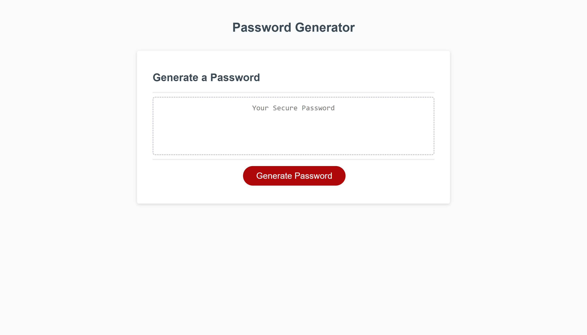

# Pass-The-Word Week 3 Password Generator

## Assignment Criteria

For this project we were given a starter code set for html and CSS for a password generator. In the Javascript we were tasked with making a password generator that would prompt the user for how many characters they would like their password to contain, and ask what kind of characters should be a part of the password as well.

## Assignment thought process

I started by creating arrays of the lowercase, uppercase, numeric, and special characters the user might want to use. 

Once the user clicks the generate password box, the write password fucntion is called.

The writePassword function calls the GetCritera function  that would have individual for loops for each of the criteria asking the user to input the length of password, and the charater types to use. If the user wanted a certain character, the loop would be true and the password selection selection pool would be concated with that array from that character. I made sure to reset the password everytime a getCriteria was reset password selection so that the criterias from the last selection wouldn't bleed into any future password asks.
 
After getCriteria is completed and returned true if the user inputed everything correctly the generate password fucntion would run and create a password for the user. IF getCriteria comes back true passwordText.value shows the password, else the box will be blank.

